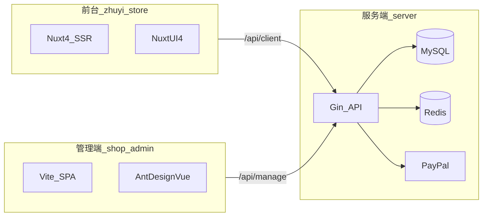

# 概述

**基于 Gin 与 Nuxt 的跨境电商独立站**（2025.08 - 2026.05 · 个人独立设计与开发，毕业设计）

独立设计并实现了一套跨境电商独立站：**Go + Gin** 提供统一业务与支付能力，**Vue 3 + Ant Design Vue** 承担运营侧管理后台，**Nuxt 4 + Nuxt UI** 承担 C 端 SSR 商城。打通「商品上架 → 前台展示 → 加购下单 → **PayPal** 支付 → 订单履约与退款」闭环，并针对**管理端 Session** 与**前台 JWT + 设备指纹**做了双轨认证，适合多角色、多端部署场景。

本项目不是从零拍脑袋的 Demo，而是建立在本人于 [[blog-广东真格软件有限公司-初级前端工程师（实习）]] 实习期间接触的企业级电商/跨境电商中后台真实业务之上；毕业设计阶段在对齐同一业务域与接口契约思维的前提下，将服务端从企业 Java 技术栈迁移为 **Go + Gin + GORM** 重写。仓库中实际存在两版前台商城代码：早期 `shop_pc` 采用 Naive UI + Tailwind CSS 3，与实习期间参与的跨境珠宝电商项目技术栈一致；毕业答辩定稿版本 `zhuyi-store` 完整升级为 Nuxt UI 4 + Tailwind CSS 4，本文以定稿版本为准展开。

# 技术栈

- **前台**（`zhuyi-store`）：Nuxt 4、Vue 3、TypeScript、Nuxt UI 4、Tailwind CSS 4、`@nuxt/eslint`
- **管理端**（`shop_admin`）：Vue 3、Vite、Ant Design Vue 4、Pinia、TypeScript、Axios、WangEditor/Quill、Cropper、xlsx、ECharts
- **服务端**（`server`）：Go 1.24、Gin、GORM、MySQL、Redis、Viper、JWT、PayPal SDK、gomail

# 系统架构

前后端分离，JSON REST，全局 CORS，静态上传走 `/api/oss`；`docker-compose` 编排 MySQL、Redis、Backend，前台容器通过环境变量区分浏览器访问后端的地址与 SSR 容器内访问后端的地址。

# 核心工作与技术亮点

**1. 前台 Web（`zhuyi-store`）——Docker 下双 BaseURL 配置**

难点：Docker 部署时，浏览器访问后端常用 `localhost:8080`，而 Nuxt SSR 在容器内访问后端需使用服务名（如 `http://backend:8080`）；单一 `baseURL` 会导致构建期预渲染或 SSR 请求失败或指向错误主机。解法：在 `nuxt.config.ts` 的 `runtimeConfig` 中拆分 `apiUrl`（仅服务端）与 `public.apiUrl`（浏览器），分别由 `NUXT_API_URL` 与 `NUXT_PUBLIC_API_URL` 注入，请求封装按渲染分支读取对应配置。

一次真实的分页 Bug 排查（2026-05）：首页与分类页点击分页组件页码后列表完全不刷新。原因是 `@nuxt/ui 4` 的 `<UPagination>` 把页码做成了**具名 v-model：`page`**（对应事件 `update:page`），而非 Vue 默认的 `modelValue`/`update:model-value`；写成默认 v-model 语法后组件内部翻页事件根本不会被监听到。修复为统一改用具名 v-model `v-model:page`。收获：升级/替换 UI 组件库大版本时，"v-model 语法能编译通过"不代表"契约对得上"，必须去读组件的 Props/Emits 类型定义逐个核对。

**2. 管理端（`shop_admin`）——RBAC 与复杂表单**

后端权限模型与前端路由 `meta.permission`、自定义指令（如 `v-permission`）配合，实现菜单级 + 按钮级控制；多规格 SKU、富文本详情、图片上传与裁剪等复杂表单资源编辑，考验状态拆分与提交流程设计。

**3. 服务端（`server`）——与 Java 企业后台的分层对照**

在真格软件阶段熟悉的典型 Java 后端分层（Controller / Service / DAO）与中间件思维，在本项目中映射为 **Gin Handler → Service → Repository**，依赖注入由 `ServiceFactory` / `RepositoryFactory` 承担，便于按模块逐项对照域模型与边界迁移，而非简单"翻译语法"。路由分两组：`/api/manage/*`（Redis Session，运营侧）与 `/api/client/*`（设备指纹中间件 + 可选 JWT，C 端）。

两个真实踩坑：

- **关联表主键/外键混用导致「tags not found」**：查询商品关联标签时，多对多关联表 `ShopTagIndex` 自身有一个自增主键 `ID`，同时还有一个指向 `shop_tag` 表的外键字段 `TagID`；代码里误把关联表自身的主键当成了标签 ID 传下去，导致商品详情页标签查询永远查不到记录，编译期完全不会报错，只能靠接口联调时发现。
- **清理 AI 辅助生成的冗余代码**：项目早期用 AI 辅助搭了一批按业务域分包的 repository（约 30 个文件）和一批未被任何路由实际使用的 handler；随着业务收敛，有效的 repository 拍平合并成扁平结构，确认无用的代码不是直接删除，而是改名为 `*.go.backup` 挪进 `bak/` 目录保留痕迹。

# 量化成果

- **子系统**：3 个（管理后台、SSR 前台商城、后端 API）联调可用；
- **接口规模**：`router.go` 实测 **107** 处 RESTful 接口注册（管理端 + 客户端两组前缀合计）；
- **后端**：实测 **165** 个 Go 源文件（不含 `bak/`），**47** 个模型文件、覆盖 **30+** 张业务表；
- **管理端**：实测 **98** 个页面级 `.vue` 文件、**154** 个 `.vue`/`.ts` 源文件，覆盖商品、订单、CMS、系统管理等 **10+** 业务模块；
- **前台**：实测 **10** 个核心页面（首页、集合、详情、购物车、结算、订单详情、登录、注册、地址、博客）；
- **认证方式**：**2** 套（Redis Session + JWT 体系）。

# 项目收获

- **架构判断力**：把一套业务从"AI 一次性生成的按域分包骨架"收敛成"按实际调用关系拍平重构"的过程，比一开始就写对更能锻炼"什么值得抽象、什么是过度设计"的判断力。
- **排查而非猜测的习惯**：分页失效和标签查询失败这两个 bug 的共同点是"现象看起来随便猜一个原因都说得通，但只有对照组件的具名 v-model 契约、关联表的字段语义逐行排查才能定位真因"。
- **诚实评估自己代码的能力**：回头复核旧文档时发现"找回密码"入口两端都没真正接通、Docker 部署文档漏写了一个服务，这提醒自己写文档和写代码要同步演进。
- **技术栈迁移的完整体感**：从 Naive UI 到 Nuxt UI 4 不只是换包名，而是组件契约、类型定义、代码风格三方面同时变化的一次真实迁移。

# 诚实边界

登录页确实有「忘记密码？」入口并指向 `/forgot-password`，但该页面文件从未实现，点击会直接 404；后端侧对应的 service/repository 也只以 `*.go.backup` 形式躺在备份目录里，从未接入路由。面试应如实表述为"找回密码在前后端都预留了设计但尚未完整打通"。

# 相关链接

- [[blog-广东真格软件有限公司-初级前端工程师（实习）]]
